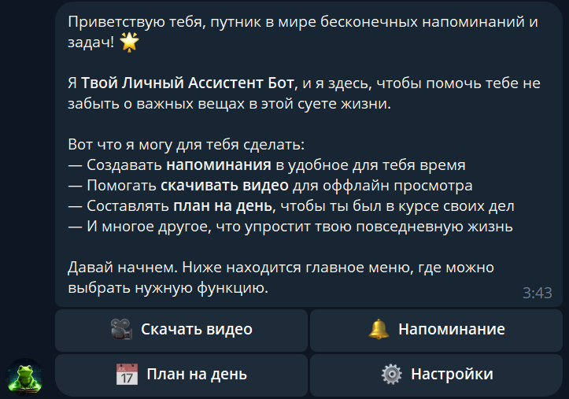

# **Bot DailyHelper**

[](https://t.me/DailyHelper8_bot)
[](https://github.com/PavelFr8/Bot-EveryDay/blob/master/LICENSE)
[](https://www.docker.com/)
[](https://www.postgresql.org/)



---

## 📖 Description

**Bot DailyHelper** - Telegram bot for your daily productivity.

It can:

* 🗓 **Plan** — create and manage task lists and reminders.
* 📥 **Download media** — video and audio from links using the [Cobalt API](https://github.com/imputnet/cobalt).
* ⚡ Run **fully in Docker**, making deployment simple and fast.

---

## 🛠 Technologies

| Component            | Description                         |
| -------------------- | ----------------------------------- |
| **Python 3.10+**     | Primary development language        |
| **aiogram 3.x**      | Asynchronous Telegram Bot framework |
| **FastAPI**          | Handling webhook and API requests   |
| **PostgreSQL**       | Reliable relational database        |
| **SQLAlchemy 2.0**   | Asynchronous ORM                    |
| **Cobalt API**       | Video/audio downloading             |
| **Docker + Compose** | Isolated environment                |
| **Nginx**            | Proxy and request routing           |

---

## 🚀 Installation and Running

> Before starting, make sure you have installed [Docker](https://docs.docker.com/get-docker/) and [Docker Compose](https://docs.docker.com/compose/).

### 1. 📂 Clone the repository

```bash
git clone https://github.com/PavelFr8/Bot-EveryDay.git
cd Bot-EveryDay
```

### 2. ⚙ Configure `.env`

Copy the `.env` template and fill it with your values:

```bash
# Linux / MacOS
cp template.env .env

# Windows
copy template.env .env
```

Specify:

* `BOT_TOKEN` — your Telegram bot token
* `DATABASE_URL` — PostgreSQL connection string
* `HOST_URL` — external URL (ngrok or server)

### 3. 🌐 Run a tunnel

If you use **ngrok**:

```bash
ngrok http 8080
```

Copy the generated address like `https://xxxx.ngrok-free.app` into the `HOST_URL` variable in `.env`.

### 4. 📦 Build and run containers

```bash
docker compose up -d --build
```

After containers start, the bot will automatically register the webhook at the specified `HOST_URL`.

---

## 📊 Architecture


---

## 📜 License

This project is licensed under the [AGPL-3.0](https://www.gnu.org/licenses/agpl-3.0.html).

**Cobalt API** is also licensed under the [AGPL-3.0](https://www.gnu.org/licenses/agpl-3.0.html).
