# **Bot DailyHelper**

[](https://t.me/DailyHelper8_bot)
[](https://github.com/PavelFr8/Bot-EveryDay/blob/master/LICENSE)
[](https://www.docker.com/)
[](https://www.postgresql.org/)


---

## 📖 Описание

**Bot DailyHelper** — это Telegram-бот для вашей ежедневной продуктивности.
Он умеет:

* 🗓 **Планировать** — создание и управление списками задач и напоминаниями.
* 📥 **Скачивать медиа** — видео и аудио по ссылкам с помощью [Cobalt API](https://github.com/imputnet/cobalt).
* ⚡ Работать **полностью в Docker**, что делает развёртывание простым и быстрым.

---

## 🛠 Технологии

| Компонент            | Описание                               |
| -------------------- | -------------------------------------- |
| **Python 3.10+**     | Основной язык разработки               |
| **aiogram 3.x**      | Асинхронный Telegram Bot фреймворк     |
| **FastAPI**          | Обработка webhook и API-запросов       |
| **PostgreSQL**       | Надёжная реляционная база данных       |
| **SQLAlchemy 2.0**   | Асинхронная ORM                        |
| **Cobalt API**       | Скачивание видео/аудио                 |
| **Docker + Compose** | Изолированное окружение                |
| **Nginx**            | Проксирование и маршрутизация запросов |

---

## 🚀 Установка и запуск

> Перед началом убедитесь, что установлены [Docker](https://docs.docker.com/get-docker/) и [Docker Compose](https://docs.docker.com/compose/).

### 1. 📂 Клонируйте репозиторий

```bash
git clone https://github.com/PavelFr8/Bot-EveryDay.git
cd Bot-EveryDay
```

### 2. ⚙ Настройте `.env`

Скопируйте шаблон `.env` и заполните его своими значениями:

```bash
# Linux / MacOS
cp template.env .env

# Windows
copy template.env .env
```

Укажите:

* `BOT_TOKEN` — токен вашего Telegram-бота
* `DATABASE_URL` — строка подключения к PostgreSQL
* `HOST_URL` — внешний URL (ngrok или сервер)

### 3. 🌐 Запустите туннель

Если используете **ngrok**:

```bash
ngrok http 80
```

Скопируйте выданный адрес `https://xxxx.ngrok-free.app` в переменную `HOST_URL` в `.env`.

### 4. 📦 Сборка и запуск контейнеров

```bash
docker compose up -d --build
```

После старта контейнеров бот автоматически зарегистрирует вебхук на указанный `HOST_URL`.

---

## 📊 Архитектура



---

## 📜 Лицензия

Проект распространяется под лицензией [AGPL-3.0](https://www.gnu.org/licenses/agpl-3.0.html).
**Cobalt API** также распространяется под лицензией [AGPL-3.0](https://www.gnu.org/licenses/agpl-3.0.html).
