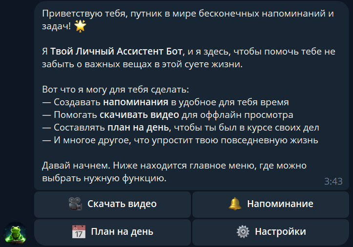

# Bot Helper
<a href="https://t.me/DailyHelper8_bot"></a>  

Bot Helper - Telegram Bot, which gets you the opportunity create plans for a day, notifications and download video.



## Used technology
* Python 3.9;
* aiogram 3.x (Telegram Bot framework);
* PostgreSQL (database);
* SQLAlchemy (working with database from Python);
* [Cobalt API](https://github.com/cobalthq/cobalt-api-docs) (downloading video) 

## How to start bot
Write your bot token to **.env**
Write your database url to **.env**

```ubuntu
pip install -r requirements.txt
```

Run ngrok server
```ubuntu
ngrok http 8080
```

Run bot
```ubuntu
python3 main.py <ngrok_url>
```
